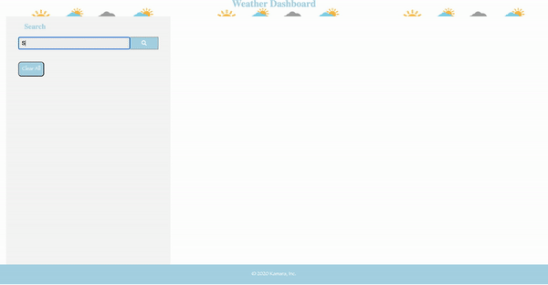

# Weather-Dashboard
Weather App

<h2>Summary</h2>
This is a weather dashboard application that provides the user with weather comnditions of their city of choice. The application also present the user futurw five day weather conditons for that city. The application utilizes AJAX to hook into OpenWeather API to retrieve data in JSON format. Using dynamic HTML, CSS and Javascript powered by jQuery, the app is able to show the user the current weather conditions:

    - City
    - Date
    - Icon image (visual representation of weather conditions)
    - Temperature
    - Humidity
    - Wind speed
    - UV index 

Include a 5-Day Forecast below the current weather conditions:

    - Date
    - Icon image (visual representation of weather conditions)
    - Temperature
    - Humidity

<h2>Weather-Dashboard Demo</h2>

<h2>Techonologies Used</h2>

    -CSS
    -Git
    -GitHub
    -HTML
    -Javascript
    -jQuery
    -Moment.js

<h2>Challenges, Opportunities for Improvement</h2>
In the beiginning of the build, had an issue with the API calls. I kept getting 404 and 401 errors in relations to my calls. After working on figuring out the reason for the error codes, I was able to fix my code and correct the API calls. I wanted to make sure that I was getting the right information from my call and utilized the data that was presented to me by the API. I utilized the five day forecast that updates every 3 hours from the OpenWeather API. That presented a unique challenge and really required me spending some time trying to go through the array and access what I wanted.

This application is open for contributions and updates to all those who have ideas to improve or contribute.
You can access the application through this following link:

<h2><a href='https://kamara-moses.github.io/Weather-Dashboard/'>Weather-Dashboard</a></h2> 
    
